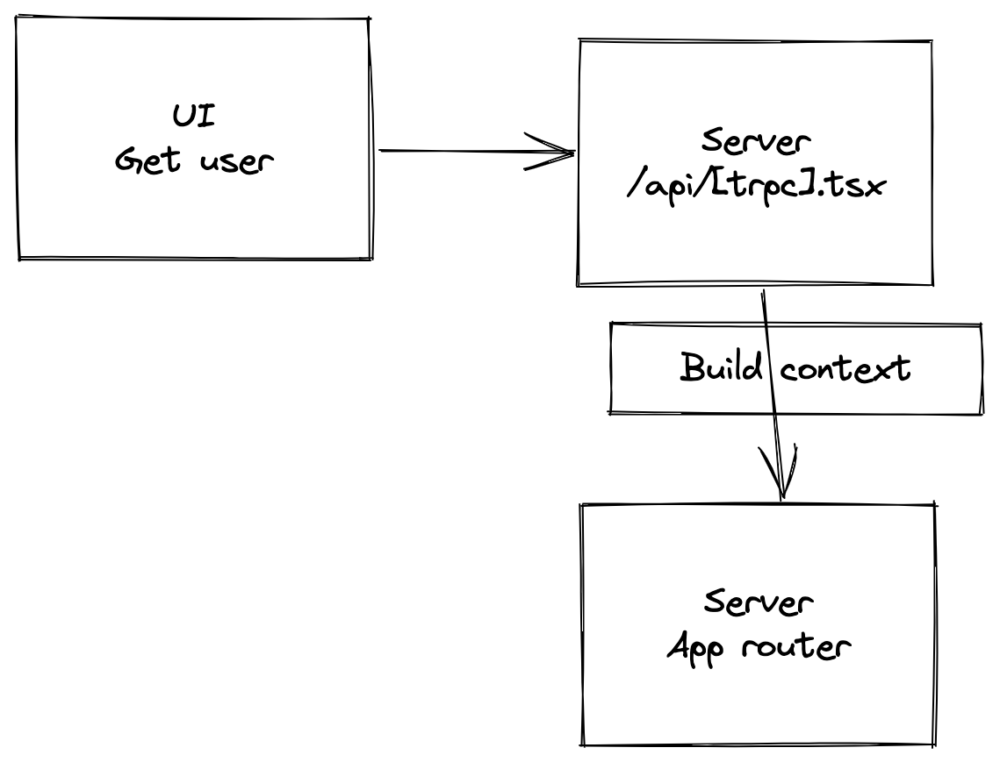

# tRPC with Next.js, TypeScript & Prisma

## Why you should be learning & using tRPC
* Making E2E type-safe APIs is fun and easy
* Gives you a deeper understanding of Next.js 
* Going to be very popular (prediction)

## Technologies used
* tRPC
* TypeScript
* Prisma (Postgres)
* Zod - Schema validation & type generation
* nodemailer - Sending OTP emails

## Features
* Register user
* Login with OTP
* Create a post
* View a post
* List posts

## What will you learn?
* Enough tRPC to be productive
* Using Next.js as a monorepo
* Some TypeScript
* OPT login flow

## What you will need
* A running instance of a DB (Postgres, Mongo, SQLlite, MYSQL) - Postgres

## Video structure
1. Demo
2. Code walk-through

3. Bootstrap application
    - Create app router
    - Create router base
    - Configure _app.tsx
    - Make a request
    - Configure prisma
4. Register user
    - Create a user model
    - Create register user schema
    - Configure user router
    - Register user resolver
    - Register UI
5. User login
    - Add login token to prisma
    - Login schema
    - Configure mailer
    - Verify login schema
    - Login resolver
    - Verify login resolver
    - Login UI
6. Create post
    - Add post to prisma
    - Create post router
    - Create post resolver
    - Create post UI
7. List posts
    - List posts resolver
    - List posts UI
8. View single post
    - Query post schema
    - Query post resolver
    - Post UI
